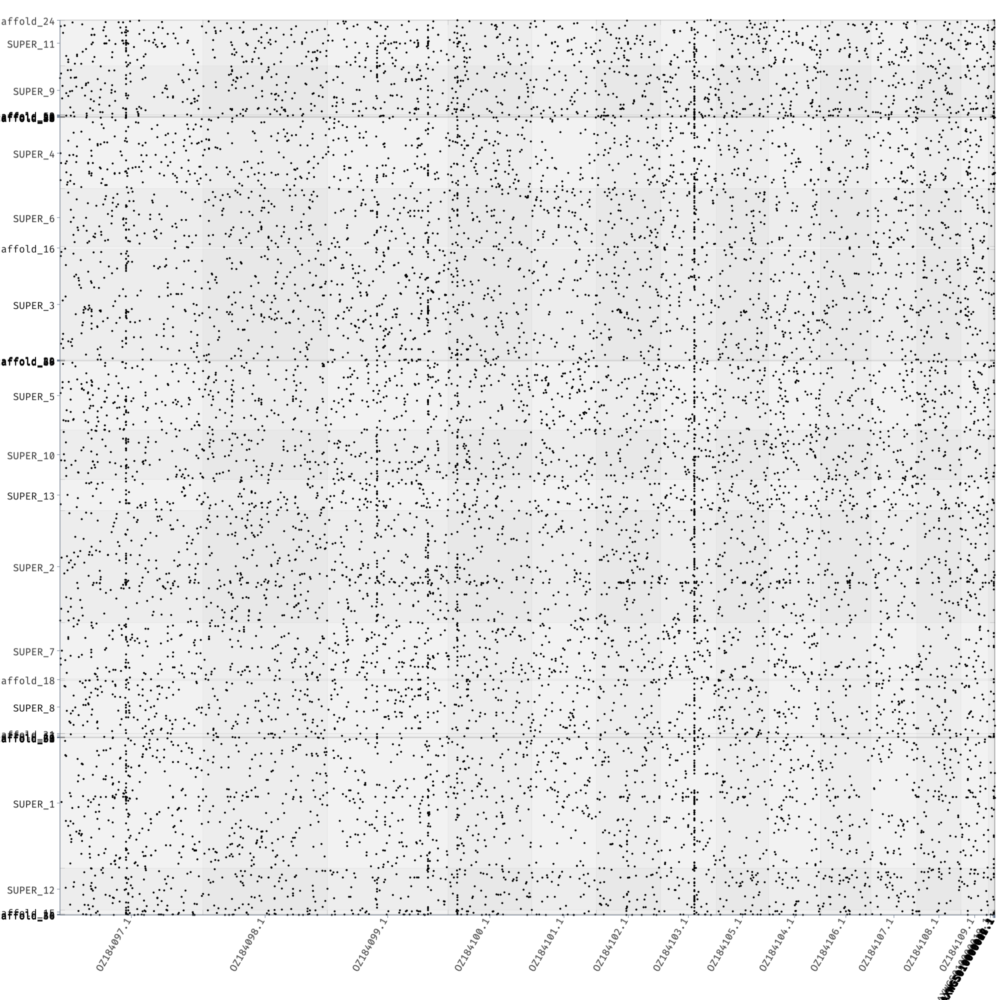
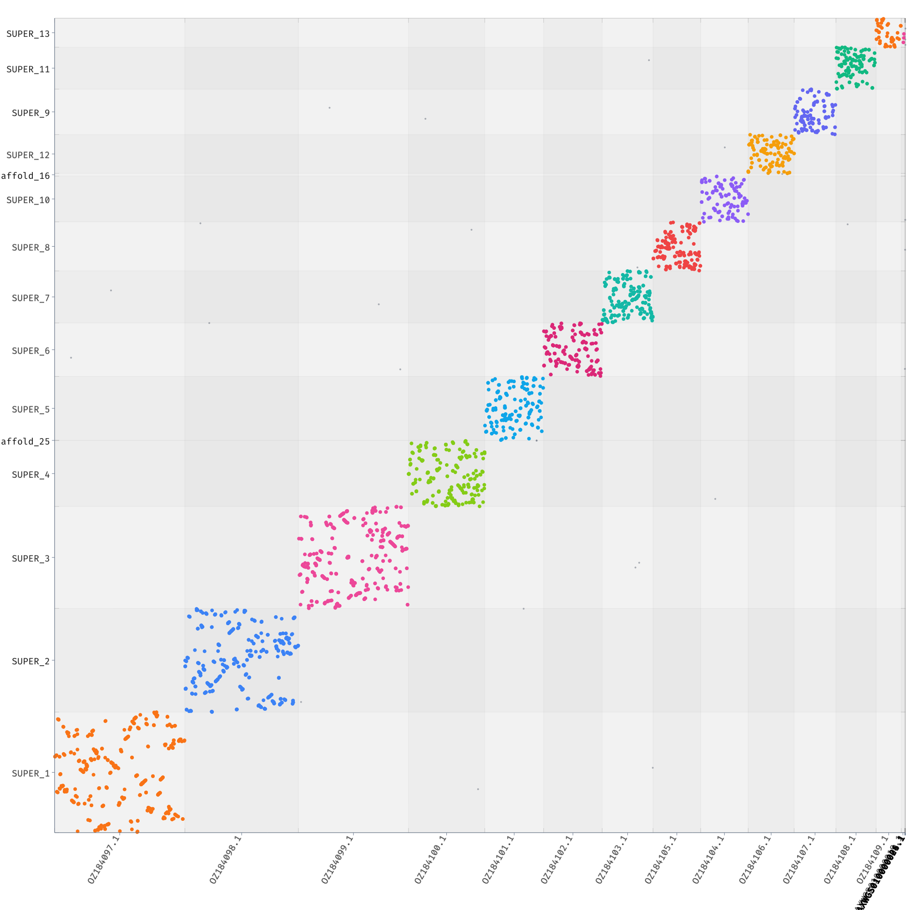

# HoBRAC - Homology-based reference genome acquisition and comparison

The purpose of HoBRAC is to facilitate structural comparison between two genomes. Direct genome-to-genome alignments are sometimes too noisy to easily analyze so conserved busco genes are used instead. Here are the major steps conducted in HoBRAC:
  - the user provides a genome assembly fasta file, a taxid and the organism name
  - the lineage of the organism is retrieved thanks to Taxonkit
  - HoBRAC downloads the MASH database corresponding to the phylum of the assembly (we pre-computed a database per phylum and are making it available [here](https://www.genoscope.cns.fr/lbgb/mash/))
  - MASH is ran on all genomes of the selected phylum to determine which one is the closest to the provided assembly
  - HoBRAC chooses the closest Busco dataset to use (based on taxonomy) and Busco is ran on the closest reference genome (based on the MASH distance) and on the assembly. A PAF file containing the positions of the Busco genes on the reference and on the assembly is created
  - Minimap2 is launched to align the closest reference (based on the MASH distance) and the assembly
  - Dotplots from the genome-to-genome alignment and the busco positions are generated. For convenience, an alignment viewer is available [here](https://www.genoscope.cns.fr/lbgb/hobrac/)


On the left is the genome-to-genome alignment of Felimare picta (y-axis) vs Phyllidia flava (x-axis) and on the right the alignment of busco genes for the same genomes.

|  |  |
| ------- | ------- |
|  |  |


## Dependencies

HoBRAC relies on several dependencies. You can either install them manually or use containers (see [Using Containers](#using-containers) below).

  - Python >= 3.11
  - [Taxonkit](https://github.com/shenwei356/taxonkit)
  - [NCBI datasets](https://github.com/ncbi/datasets) 
  - [MASH](https://github.com/marbl/Mash)
  - [Busco](https://gitlab.com/ezlab/busco)
  - [Minimap2](https://github.com/lh3/minimap2)
  - [dotplotrs](https://github.com/Genoscope-LBGB/dotplotrs)

## Installation

```
git clone https://github.com/Genoscope-LBGB/hobrac
cd hobrac
pip install .
```

## Usage 

HoBRAC only needs three mandatory parameters:
  - `-a`: path to a genome assembly fasta file
  - `-n`: the scientific name of the organism between quotes
  - `-t`: the taxid of the organism

The `-o` argument is optional and is used to indicate the path to an output folder that will be created by HoBRAC.

A typical HoBRAC command looks like this:
```
hobrac -a scaffolds.fa -n 'Lepadogaster purpurea' -t 164309 -o hobrac_lepadogaster_purpurea
```

By default, HoBRAC runs computations on the machine it is launched, but being a Snakemake pipeline wrapper it can also submit jobs to a computing grid. HoBRAC is packaged with `snakemake-executor-plugin-slurm` which makes it possible to use a SLURM computing grid, it is the responsibility of the user to install the correct plugin for their computing grid. To launch jobs on a computing grid, you can use the `-e` flag with the correct plugin. As an example, this command will launch HoBRAC jobs on a slurm grid:
```
hobrac -a scaffolds.fa -n 'Lepadogaster purpurea' -t 164309 -o hobrac_lepadogaster_purpurea -e slurm
``` 


The list of available plugins is available [here](https://snakemake.github.io/snakemake-plugin-catalog/).

## Manual Reference

By default, HoBRAC selects the closest reference genome automatically via MASH. However, it is possible to provide one or more reference genomes manually using the `-r` flag, which disables the reference searching step entirely.

```
hobrac -a scaffolds.fa -n 'Lepadogaster purpurea' -t 164309 -r my_reference.fa
```

Multiple references can be specified by repeating the flag:

```
hobrac -a scaffolds.fa -n 'Lepadogaster purpurea' -t 164309 -r reference_1.fa -r reference_2.fa
```

When references are downloaded automatically, their sequences are renamed to `chr<name>` using the NCBI assembly report. Manual references skip that step, so HoBRAC instead makes a best-effort pass over each FASTA header and renames the sequence to a `chr<token>` name when it recognizes one. Two header styles are handled: a literal `chr<token>` (e.g. `chr1`, `chrX`, `chr2L`, `chrMT`) and the descriptive GenBank/ENA form (e.g. `... chromosome 1, whole genome shotgun sequence` or `... chromosome: 4`), which is normalized to `chr1`, `chr4`, etc. For every manual reference, a `reference/<name>.chr_rename.tsv` mapping file (`old_name<TAB>new_name`, one row per sequence) is written so the renaming stays traceable. Headers without a recognizable chromosome are left unchanged.

## Pre-computed BUSCO Results

BUSCO is among the most time-consuming steps of the pipeline. If BUSCO was already computed for the assembly or the reference, the results can be reused with the `--busco-assembly` and `--busco-reference` flags. Each flag accepts a path to a BUSCO result directory, a `run_*` subdirectory, or a `full_table.tsv` file directly.

```
hobrac -a scaffolds.fa -n 'Lepadogaster purpurea' -t 164309 \
    --busco-assembly /path/to/busco_assembly \
    --busco-reference /path/to/busco_reference
```

## Multi-Reference Selection

By default, HoBRAC compares your assembly to the single closest reference genome found via MASH. You can choose to compare against multiple reference genomes using the `--ref-count` flag. This will identify the top N closest genomes and run the full analysis pipeline (Alignments, BUSCO) against each of them in parallel.

```
# Compare against the top 3 closest reference genomes
hobrac -a scaffolds.fa -n 'Lepadogaster purpurea' -t 164309 --ref-count 3
```


## Skip Genomic Alignment

The genome-to-genome alignment (Minimap2) can be the most time-consuming part of the pipeline and its dotplots are sometimes too noisy to be useful. The `--skip-genomic` flag disables this step entirely, so only the BUSCO side runs (BUSCO, the JCVI karyotype, and the ALG-colored dotplots, which are derived from BUSCO gene positions rather than from the Minimap2 alignment).

```
hobrac -a scaffolds.fa -n 'Lepadogaster purpurea' -t 164309 --skip-genomic
```


## JCVI Karyotype Visualization

In addition to dotplots, HoBRAC can produce JCVI karyotype plots that display synteny relationships between chromosomes. Shared BUSCO genes are drawn as colored links between the assembly and each reference genome, which makes it possible to identify large-scale rearrangements at a glance. A karyotype PNG is generated automatically as part of the pipeline output.

### ALG Coloring

By default, links are colored uniformly. To color genes according to Ancestral Linkage Groups (ALGs), three options are available:

```
# Use the pre-computed 29-metazoan-ALG color scheme
hobrac -a scaffolds.fa -n 'Lepadogaster purpurea' -t 164309 --color-metazoan-alg

# Use the pre-computed 24-bilaterian-ALG color scheme
hobrac -a scaffolds.fa -n 'Lepadogaster purpurea' -t 164309 --color-bilaterian-alg

# Use a custom color file
hobrac -a scaffolds.fa -n 'Lepadogaster purpurea' -t 164309 --custom-colors colors.tsv
```

Pre-computed color schemes are available for the following BUSCO datasets: actinopterygii, anthozoa, arthropoda, cnidaria, crustacea, lophotrochozoa, metazoa, mollusca and vertebrata. If the BUSCO dataset selected by the pipeline is not part of this set, HoBRAC falls back to default coloring.

The custom color file is a tab-separated file with three columns: a BUSCO gene ID, a color (as `R,G,B`, `#RRGGBB`, or `RRGGBB`), and an ALG name. As an example:

```
3189364at33208	#e54656	J2
4255818at33208	#a3757d	F
4283313at33208	#aa7e27	Ea
```

When using custom colors, ALG statistical testing still runs by default in order to determine which chromosome associations are significant. Genes that are not in the color file or that are not part of a significant association are shown in grey. The `--skip-alg` flag disables statistical testing entirely, so that all genes listed in the color file receive their custom color regardless of significance.

### ALG Detection Parameters

HoBRAC detects significant chromosome associations using Fisher's exact test with Bonferroni correction. The following parameters control this behavior:

  - `--alg-pvalue`: base significance threshold (default: 0.01)
  - `--min-chain-genes`: minimum BUSCO genes a chromosome chain must be supported by to appear in the output (default: 5)
  - `--permissive-alg`: relax chain validation so that each node only needs one significant link instead of n/2
  - `--hide-non-significant`: hide links between chromosome pairs without significant associations, which produces a cleaner plot

### Other Synteny Options

  - `--min-busco-genes`: minimum number of complete BUSCO genes required per sequence for a chromosome to appear in the plot (default: 30)
  - `--names`: comma-separated custom names for the tracks in the plot. If one name is provided, it applies to the assembly only. If multiple names are provided, the count must equal 1 (assembly) + number of references.

## Output

If everything went as expected, the output directory should contain the following structure:

```
hobrac_analysis/
├── mash/
│   ├── mash.dist                    # MASH distances between the assembly and all genomes
│   └── selected_accessions.txt      # Accession IDs of the selected reference(s)
├── reference/
│   └── <accession>.fna              # Downloaded reference genome(s)
├── busco/
│   ├── busco_assembly/              # BUSCO results for the assembly
│   ├── busco_reference_<accession>/ # BUSCO results for each reference
│   └── chosen_dataset.txt           # BUSCO dataset that was selected
├── aln/
│   ├── vs_<accession>/
│   │   ├── aln.paf                  # Minimap2 genome-to-genome alignment
│   │   ├── dotplot.png              # Genome-to-genome dotplot (color)
│   │   ├── dotplot_bw.png           # Genome-to-genome dotplot (black & white)
│   ├── busco_<accession>/
│   │   ├── aln_busco.paf            # BUSCO-based alignment in PAF format
│   │   ├── dotplot_busco.png        # BUSCO dotplot (color)
│   │   ├── dotplot_busco_bw.png     # BUSCO dotplot (black & white)
│   ├── rank1_<Species_name>_busco -> busco_<accession>/  # Ranked symlinks (closest first)
│   └── rank1_<Species_name>_geno  -> vs_<accession>/
├── synteny_plots/
│   ├── karyotype.png                # JCVI karyotype plot
│   ├── dotplots/                    # Per-reference ALG dotplots
│   ├── dotplots_grid.png            # All per-reference dotplots tiled
│   └── dotplots_grid_dark.png
├── benchmarks/                      # Runtime and resource usage per step
```

When using `--ref-count`, the `aln/` directory will contain one `vs_<accession>` and one `busco_<accession>` subdirectory per reference, along with numbered symlinks (`rank1_<Species_name>_*`, `rank2_<Species_name>_*`, ...) sorted by MASH distance. The `rank<i>` prefix keeps each symlink unique even when two references belong to the same species; references without an NCBI assembly report (e.g. manual references) fall back to the accession in place of the species name.

The PAF alignment files can be loaded directly into the [online viewer](https://www.genoscope.cns.fr/lbgb/hobrac/) for interactive exploration.

## Using Containers

HoBRAC supports running all workflow steps inside containers, which eliminates the need to manually install dependencies. A Docker image containing all required tools is available at `ghcr.io/cea-lbgb/hobrac-tools`.

### With Singularity/Apptainer (recommended for HPC)

```
hobrac -a scaffolds.fa -n 'Lepadogaster purpurea' -t 164309 -o hobrac_lepadogaster_purpurea --use-apptainer
```

### With Docker

```
hobrac -a scaffolds.fa -n 'Lepadogaster purpurea' -t 164309 -o hobrac_lepadogaster_purpurea --use-docker
```

### Taxonkit Database

When using containers, you need to provide the Taxonkit taxonomy database. Download it from [NCBI](https://ftp.ncbi.nih.gov/pub/taxonomy/taxdump.tar.gz) and set the `TAXONKIT_DB` environment variable to point to the directory containing the extracted files:

```
export TAXONKIT_DB=/path/to/taxonkit_db
hobrac -a scaffolds.fa -n 'Lepadogaster purpurea' -t 164309 -o hobrac_lepadogaster_purpurea --use-apptainer
```

## Visualization

To enable manual inspection of the alignments, a viewer is available online on our [website](https://www.genoscope.cns.fr/lbgb/hobrac/). This viewer makes it possible to explore alignments interactively using either the classical dotplot view or various ribbon plots.
