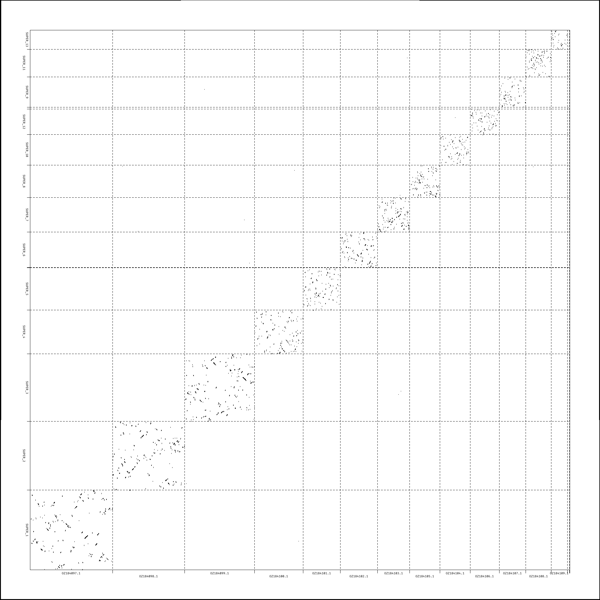

# HoBRAC - Homology-based reference genome acquisition and comparison

The purpose of HoBRAC is to facilitate structural comparison between two genomes. Direct genome-to-genome alignments are sometimes too noisy to easily analyze so conserved busco genes are used instead. Here are the major steps conducted in HoBRAC:
  - the user provides a genome assembly fasta file, a taxid and the organism name
  - the lineage of the organism is retrieved thanks to Taxonkit
  - HoBRAC downloads the MASH database corresponding to the phylum of the assembly (we pre-computed a database per phylum and are making it available [here](https://www.genoscope.cns.fr/lbgb/mash/))
  - MASH is ran on all genomes of the selected phylum to determine which one is the closest to the provided assembly
  - HoBRAC chooses the closest Busco dataset to use (based on taxonomy) and Busco is ran on the closest reference genome (based on the MASH distance) and on the assembly. A PAF file containing the positions of the Busco genes on the reference and on the assembly is created
  - Minimap2 is launched to align the closest reference (based on the MASH distance) and the assembly
  - Dotplots from the genome-to-genome alignment and the busco positions are generated. For convenience, an alignment viewer is available [here](https://www.genoscope.cns.fr/lbgb/hobrac/)


On the left is the genome-to-genome alignment of Felimare picta (y-axis) vs Phyllidia flava (x-axis) and on the right the alignment of busco genes for the same genomes.

|  |  |
| ------- | ------- |
|  |  |


## Dependencies

HoBRAC relies on several dependencies. You can either install them manually or use containers (see [Using Containers](#using-containers) below).

  - Python >= 3.11
  - [Taxonkit](https://github.com/shenwei356/taxonkit)
  - [NCBI datasets](https://github.com/ncbi/datasets) 
  - [MASH](https://github.com/marbl/Mash)
  - [Busco](https://gitlab.com/ezlab/busco)
  - [Minimap2](https://github.com/lh3/minimap2)
  - [dotplotrs](https://github.com/Genoscope-LBGB/dotplotrs)

## Installation

```
git clone https://github.com/Genoscope-LBGB/hobrac
cd hobrac
pip install .
```

## Usage 

HoBRAC only needs three mandatory parameters:
  - `-a`: path to a genome assembly fasta file
  - `-n`: the scientific name of the organism between quotes
  - `-t`: the taxid of the organism

The `-o` argument is optional and is used to indicate the path to an output folder that will be created by HoBRAC.

A typical HoBRAC command looks like this:
```
hobrac -a scaffolds.fa -n 'Lepadogaster purpurea' -t 164309 -o hobrac_lepadogaster_purpurea
```

By default, HoBRAC runs computations on the machine it is launched, but being a Snakemake pipeline wrapper it can also submit jobs to a computing grid. HoBRAC is packaged with `snakemake-executor-plugin-slurm` which makes it possible to use a SLURM computing grid, it is the responsibility of the user to install the correct plugin for their computing grid. To launch jobs on a computing grid, you can use the `-e` flag with the correct plugin. As an example, this command will launch HoBRAC jobs on a slurm grid:
```
hobrac -a scaffolds.fa -n 'Lepadogaster purpurea' -t 164309 -o hobrac_lepadogaster_purpurea -e slurm
``` 

The list of available plugins is available [here](https://snakemake.github.io/snakemake-plugin-catalog/).

## Using Containers

HoBRAC supports running all workflow steps inside containers, which eliminates the need to manually install dependencies. A Docker image containing all required tools is available at `ghcr.io/cea-lbgb/hobrac-tools:latest`.

### With Singularity/Apptainer (recommended for HPC)

```
hobrac -a scaffolds.fa -n 'Lepadogaster purpurea' -t 164309 -o hobrac_lepadogaster_purpurea --use-apptainer
```

### With Docker

```
hobrac -a scaffolds.fa -n 'Lepadogaster purpurea' -t 164309 -o hobrac_lepadogaster_purpurea --use-docker
```

### Taxonkit Database

When using containers, you need to provide the Taxonkit taxonomy database. Download it from [NCBI](https://ftp.ncbi.nih.gov/pub/taxonomy/taxdump.tar.gz) and set the `TAXONKIT_DB` environment variable to point to the directory containing the extracted files:

```
export TAXONKIT_DB=/path/to/taxonkit_db
hobrac -a scaffolds.fa -n 'Lepadogaster purpurea' -t 164309 -o hobrac_lepadogaster_purpurea --use-apptainer
```

## Visualization

To enable manual inspection of the alignments, a viewer is available online on our [website](https://www.genoscope.cns.fr/lbgb/hobrac/). This viewer makes it possible to explore alignments interactively using either the classical dotplot view or various ribbon plots.