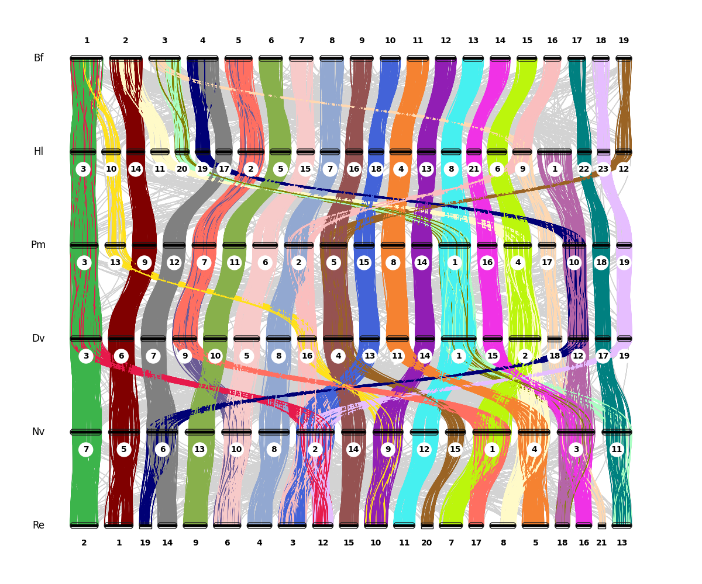
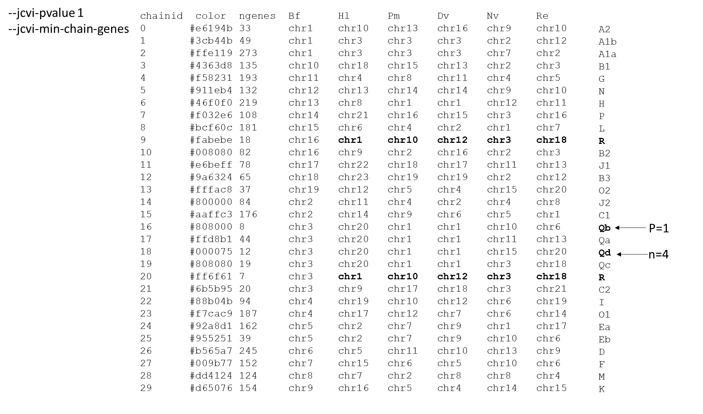
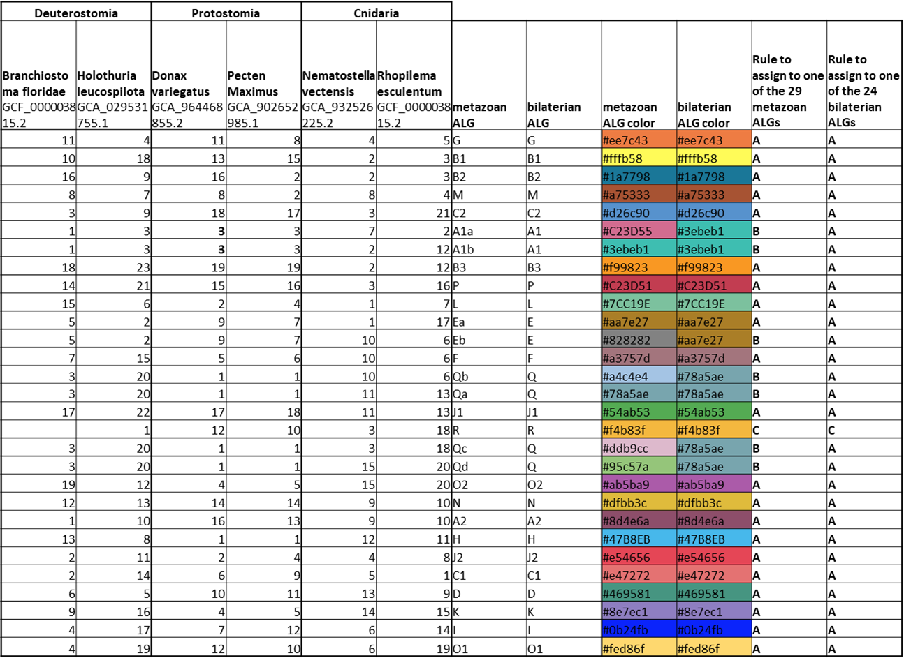

# Mapping known ALGs on BUSCO datasets

Color files corresponding to the Ancestral Linkage Groups (ALGs) defined by
Simakov *et al.* (2022) were generated for various odb12 datasets using the
following procedure.

We first used HoBRAC to build synteny ribbon-plots between 6 genome assemblies:
*Donax variegatus* plus 5 genomes commonly used for ancestral linkage group
reconstruction (Simakov *et al.*, 2022; Lewin, Liao & Luo, 2025). HoBRAC was run using the taxid corresponding to *Pecten maximus* (`-t 6579`) so that the BUSCO *mollusca* odb12 dataset would be used, with the following options:

```
--min-BUSCO-genes 10 --alg-pvalue 0.05 --permissive-alg
```

27 ALGs were detected (Table 1), corresponding to the "BCS" (Bilaterian,
Cnidarian, Sponge) groups described in Simakov *et al.* (2022) — which we will call **metazoan ALGs** for simplicity, except for Qb and Qd, which could only be recovered with less stringent thresholds.

## Figure 1 — Synteny ribbon-plot of the 6 genome assemblies



*Ribbon-plot relating the chromosomes of the 6 assemblies used for ALG
reconstruction: Bf (*Branchiostoma floridae*), Hl (*Holothuria leucospilota*), Pm (*Pecten maximus*), Dv (*Donax variegatus*), Nv (*Nematostella vectensis*) and Re (*Rhopilema esculentum*).*

## Table 1 — ALGs detected by HoBRAC

Detected with `--jcvi-pvalue 0.05` and `--jcvi-permissive-alg` (27 ALGs):


With less stringent thresholds (`--jcvi-pvalue 1`, lower `--jcvi-min-chain-genes`), the additional groups **Qb** (recovered at *P = 1*) and **Qd** (recovered at *n = 4*) can also be detected:



## Assigning BUSCO genes to ALGs

We then derived rules to assign BUSCO genes unambiguously to one of the 29
metazoan ALGs and the 24 bilaterian ALGs, based on their chromosomal locations (Table 2).

The assignment rules are:

- **A** — BUSCO gene found in at least 3 of the 6 genomes, and all chromosomes correspond to the ALG (or all but one if the BUSCO gene is found in ≥ 5 genomes).
- **B** — BUSCO gene found in at least 3 of the 6 genomes, including at least one cnidaria, and all chromosomes correspond to the ALG (or all but one if the BUSCO gene is found in ≥ 5 genomes).
- **C** — BUSCO gene found in at least 3 genomes, and all chromosomes correspond to the ALG except *Branchiostoma floridae* → group "R" (or all but one if the BUSCO gene is found in ≥ 4 genomes).

### Table 2 — ALG colors and assignment rules



## Coloring BUSCO datasets

We then performed BUSCO searches using various BUSCO genesets on the 6 genome assemblies and followed the rules defined in Table 2 to assign the BUSCO genes to metazoan and bilaterian ALGs. For each BUSCO dataset, the number of BUSCO genes to which an ALG could be assigned is shown in Table 3. We used the colors from Schultz *et al.* (2023) to color these ALGs. The color files are available (here)[https://github.com/Genoscope-LBGB/hobrac/tree/master/hobrac/colors].

### Table 3 — BUSCO genes assigned to ALGs per dataset

| BUSCO dataset         | N genes | N colored (29 metazoan ALGs) | N colored (24 bilaterian ALGs) |
| :-------------------- | :-----: | :--------------------------: | :----------------------------: |
| actinopterygii odb12  |  7207   |             1840             |              1896              |
| vertebrata odb12      |  3390   |             1606             |              1633              |
| lophotrochozoa odb12  |  1252   |             1004             |              1020              |
| mollusca odb12        |  4421   |             3086             |              3199              |
| crustacea odb12       |  1536   |             1125             |              1139              |
| anthozoa odb12        |  3649   |             1841             |              1842              |
| cnidaria odb12        |  3203   |             2197             |              2198              |
| metazoa odb12         |   672   |              514             |               516              |
| arthropoda odb12      |  1667   |             1247             |              1260              |

## Using the color files in HoBRAC

When the BUSCO dataset selected for the taxon passed to HoBRAC is available, the options `--color-bilaterian-alg` and `--color-metazoan-alg` will use the corresponding color file. Note, however, that the ALGs are also computed by HoBRAC, and only colored BUSCO genes belonging to significant ALGs will be colored. If you want to visualize **all** colored BUSCO genes, use the `--skip-alg` option.

## References

- Simakov, O., *et al.* (2022). Deeply conserved synteny and the evolution of metazoan chromosomes.
- Lewin, H. A., Liao, J. & Luo, J. (2025).
- Schultz, D. T., *et al.* (2023).
